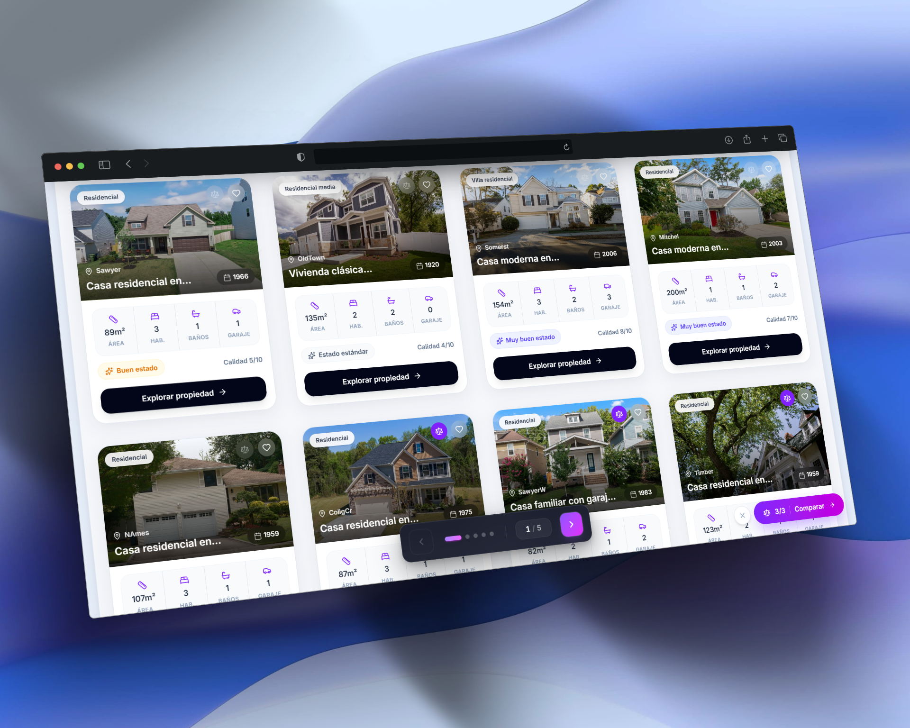
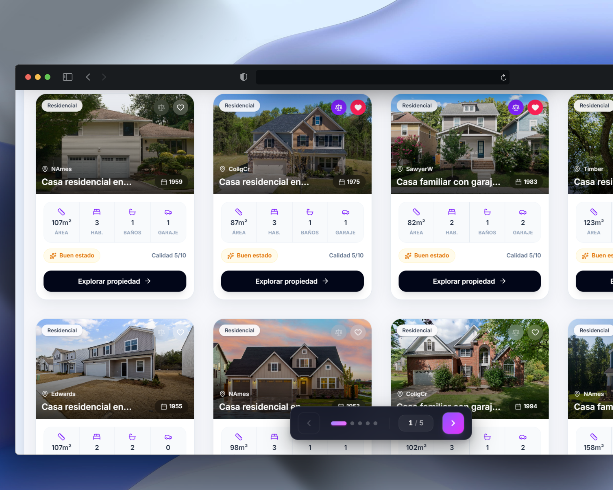
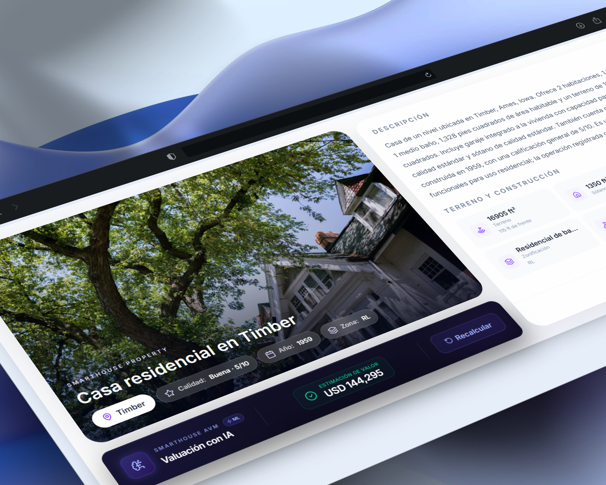

# SmartHouse AVM

SmartHouse AVM es una plataforma web Full Stack orientada a la valuación automatizada de propiedades inmobiliarias, que integra un modelo de Machine Learning dentro de una aplicación web.

El sistema permite trabajar con información de propiedades, consultar sus características y utilizar un modelo entrenado para generar una estimación de su valor probable a partir de diferentes características físicas, constructivas y de ubicación.

La plataforma integra el procesamiento de los datos, el modelo de Machine Learning, un backend con API REST, persistencia de información y una interfaz web, permitiendo que el modelo pueda utilizarse como parte de un sistema completo y no únicamente como un modelo ejecutado de forma aislada.

## Capturas de pantalla

### Portada


### Inicio


### Búsqueda y comparador


### Favoritos y comparador


### Cálculo de precio con IA


## Objetivo del proyecto

El objetivo de SmartHouse AVM es desarrollar un sistema capaz de integrar un modelo de Machine Learning en una plataforma web para generar estimaciones automatizadas del valor de propiedades inmobiliarias.

El proyecto busca conectar el proceso completo, desde el procesamiento de los datos y la ejecución del modelo hasta la exposición de las predicciones mediante una API REST y su utilización dentro de una aplicación web.

De esta forma, el sistema permite explorar cómo un modelo de Machine Learning puede integrarse dentro de una solución de software completa, combinando datos, inteligencia artificial, backend, APIs y persistencia de información.

## Tecnologías utilizadas

### Frontend

* React
* Vite
* Tailwind CSS

### Backend

* Python
* Django
* Django REST Framework
* PostgreSQL (con Docker Compose)
* SimpleJWT (autenticación con JWT)
* CORS Headers

### Inteligencia Artificial

* Pandas
* NumPy
* Scikit-Learn
* Linear Regression
* OneHotEncoder
* ColumnTransformer
* Pipeline
* Joblib

### MLOps

* MLflow
* Model Registry
* Docker

## Estructura del proyecto

```txt
SmartHouse-AVM/
├── ai-engine/
│   ├── artifacts/
│   ├── config/
│   ├── data/
│   ├── models/
│   ├── notebooks/
│   ├── reports/
│   └── src/
│
├── backend/
│   ├── core/
│   ├── users/
│   ├── predictions/
│   ├── properties/
│   ├── favorites/
│   └── manage.py
│
├── frontend/
│
├── docker-compose.yml
├── .gitignore
└── README.md
```

## Módulos principales

### AI Engine

Contiene el flujo de Machine Learning:

* Exploración de datos
* Limpieza de datos
* Entrenamiento de modelos
* Comparación de modelos
* Registro en MLflow
* Persistencia del modelo entrenado

El modelo seleccionado actualmente es una regresión lineal entrenada con el dataset Ames Housing.

El modelo se guarda en:

```txt
ai-engine/artifacts/linear_regression_model.pkl
```

### Backend Django

El backend expone APIs REST para:

* Registrar, iniciar y cerrar sesión de usuarios (JWT)
* Consultar y actualizar el perfil, y cambiar o recuperar la contraseña
* Crear propiedades
* Listar propiedades
* Consultar detalle de una propiedad
* Actualizar propiedades
* Desactivar propiedades
* Ejecutar predicciones sobre propiedades
* Guardar historial de predicciones
* Consultar estadísticas para dashboard
* Guardar y consultar propiedades favoritas por usuario

La base de datos usa PostgreSQL, levantado con Docker Compose.

## Nota importante

El modelo actual fue entrenado utilizando el dataset **Ames Housing**, proporcionado a través de la competencia **House Prices: Advanced Regression Techniques** de Kaggle.

El conjunto de datos contiene información sobre propiedades residenciales de **Ames, Iowa**, y utiliza diferentes características de las viviendas para predecir su precio de venta (`SalePrice`).

Por esta razón, las predicciones generadas por SmartHouse AVM representan **estimaciones basadas en los datos utilizados durante el entrenamiento** y no deben interpretarse como valuaciones oficiales del mercado inmobiliario mexicano.

**Fuente del dataset:**
[Kaggle — House Prices: Advanced Regression Techniques](https://www.kaggle.com/competitions/house-prices-advanced-regression-techniques?utm_source=chatgpt.com)
